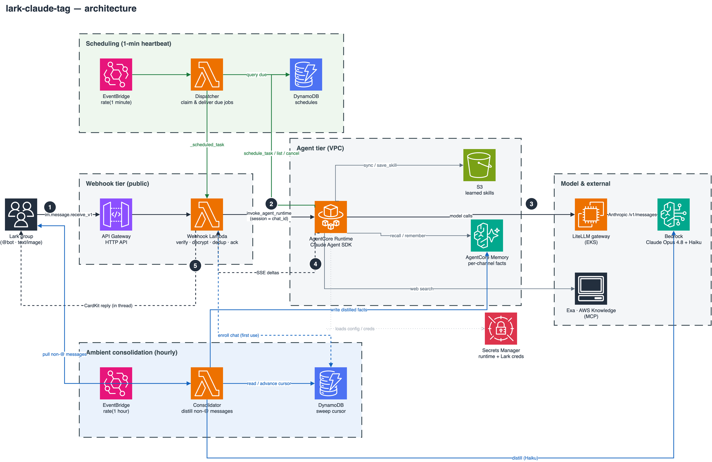

# sample-claude-tag-in-lark

A **Lark (飞书) port of Anthropic's Claude Tag** — an always-on AI teammate that
lives in group chats. Built on **Amazon Bedrock AgentCore** + the **Claude Agent
SDK**, with the model served through a **LiteLLM gateway** (→ Bedrock), so it runs
without a Claude Enterprise subscription.

> Claude Tag itself is Slack-only and Enterprise/Team-subscription-only. This
> sample reproduces its core experience on Lark and adds a self-evolving memory +
> skill loop. See `docs/REQUIREMENTS.md`.

```
###################
This sample code is provided to you as AWS Content under the AWS Customer Agreement,
or the relevant written agreement between you and AWS (whichever applies). You should
not use this sample code in your production accounts, or on production, or other
critical data. You are responsible for testing, securing, and optimizing the sample
code as appropriate for production grade use based on your specific quality control
practices and standards.
###################
```

## What it does

1. **@-mention to delegate** — @bot in a group; it breaks the task down, calls
   tools/skills, and streams the reply into the thread (live CardKit updates that
   show which tool is running).
2. **Self-evolving memory (per channel)** — actively curates its own long-term
   memory: `remember` writes durable facts into an explicit, consolidation-immune
   layer; forgetting is two-phase (`forget` lists matching candidates,
   `confirm_forget` deletes one confirmed record id — never a blind best-match
   delete); `list_memories` shows the full inventory ("what do you remember?");
   recall merges explicit facts, auto-extracted facts and the current day's
   session summary with fuzzy de-duplication and recency weighting, and a fresh
   container is re-seeded from recent raw turns. A **weekly gardener** prunes the
   auto layer (duplicates, memory-ops echo, resolved-troubleshooting residue)
   under conservative guardrails. Memory is **isolated per channel** (no
   cross-channel leakage).
3. **Self-evolving skills (global)** — after finishing a reusable multi-step task
   the agent can distill it into a Claude Code skill via `save_skill`, stored in
   S3 and **shared across all channels**; skills sync into the container at
   startup and a newly saved one takes effect the same session.
4. **Tools & skills** — Exa web search, AWS Knowledge (MCP), Lark capabilities
   (read history / create doc / deliver generated files), document skills
   (PPT / Word / Excel / PDF) and frontend design.
5. **Multimodal** — send an image with your @-mention; the bot sees it.
6. **Scheduled tasks & reminders** — ask in plain language ("过 10 分钟提醒我…",
   "每小时直到明天", "每天早上扫…新闻") and the bot schedules a future, repeating,
   or self-terminating job. A DynamoDB-backed registry + a 1-minute EventBridge
   heartbeat fire each due job: `remind` mode posts the text, `agent` mode runs a
   full turn. Fired jobs @-mention their creator; `list_tasks` / `cancel_task`
   manage them. Guardrails cap interval/count/horizon to prevent spam.
7. **Ambient group perception** — between @-mentions, an hourly job sweeps the
   messages a group sent *without* @-mentioning the bot and conservatively distills
   the durable facts among them (decisions, roles, commitments — chatter dropped)
   into that channel's memory, source-tagged `[群聊旁听]`. No new messages → no-op.
   This is perception only: the bot still speaks only when @-mentioned, but an
   @-mention now lands with the channel's recent context already in memory.

## Architecture



<sub>Reactive path (black, steps ①–⑤): @-mention → API Gateway → webhook Lambda →
AgentCore Runtime → model (LiteLLM gateway → Bedrock) / memory / skills / Exa →
SSE deltas → CardKit reply in-thread.
Scheduling path (green): 1-minute EventBridge heartbeat → dispatcher → claim due
jobs in DynamoDB → ask the webhook to deliver.
Ambient path (blue): hourly EventBridge → consolidator → pull non-@ messages from
Lark → distill durable facts (Haiku, direct to Bedrock) into per-channel memory.
Diagram source: `docs/architecture.drawio` (edit in [draw.io](https://www.drawio.com/),
export to `architecture.png`).</sub>

| Layer | Path |
|-------|------|
| Webhook Lambda (thin adapter) | `functions/lark-webhook/`, `layers/lark-shared/` |
| Agent (Claude Agent SDK) | `larkclaudetag/app/larktag/` (deployed to AgentCore Runtime) |
| Memory integration | `larkclaudetag/app/larktag/memory.py` (+ `infra/agentcore/create_memory.py`) |
| Self-evolving skills | `larkclaudetag/app/larktag/skill_store.py` (S3-backed) |
| Scheduled tasks / reminders | agent tools `larkclaudetag/app/larktag/schedule.py`; heartbeat `functions/dispatcher/`; DynamoDB + EventBridge in `template.yaml` |
| Ambient consolidation | hourly sweep `functions/consolidator/`; per-chat cursor DynamoDB + `rate(1 hour)` EventBridge in `template.yaml` |
| Infra | `template.yaml` (Lambda/APIGW/DynamoDB/EventBridge SAM), `larkclaudetag/agentcore/` (AgentCore CDK) |

The Lambda is a thin webhook adapter (verify/decrypt/dedup/ack/async); all agent
work happens in the AgentCore Runtime container running the Claude Agent SDK
against the LiteLLM gateway.

## Key design constraints (important)

- **LiteLLM backend is a Bedrock provider (pseudo-passthrough):** built-in
  server-side tools (WebSearch, code_execution), the `effort` beta, and
  `budget_tokens` are silently dropped. → only **client-side** tools (MCP /
  `@tool`) + **Claude Code-style local skills**; no betas; thinking adaptive or off.
- **Claude Agent SDK spawns the `claude` CLI subprocess** (needs Node + the CLI
  in the container) and its bundled binary ignores `ANTHROPIC_BASE_URL` → force
  `cli_path=shutil.which("claude")`.
- **AgentCore Memory ↔ Agent SDK is manual** (no Strands turnkey session manager):
  retrieve before the turn; direct `BatchCreateMemoryRecords` for explicit
  memory; `create_event` after the turn feeds async long-term extraction.
- **AgentCore Memory data-plane reaches the runtime via a VPC interface endpoint**
  in VPC mode — new API actions must be allowed on **both** the runtime IAM role
  **and** the VPC endpoint policy.

## Setup checklist (you must provide)

| Item | Where |
|------|-------|
| **LiteLLM** ALB URL + key + model **alias** | Runtime config secret `ANTHROPIC_BASE_URL` / `ANTHROPIC_API_KEY` / `LITELLM_MODEL` |
| **Lark self-built app**: app_id/secret/encrypt_key/verification_token; scopes `im:message`, `im:message:send_as_bot`, `im:resource`, `cardkit:card:read/write`, `docx:document`; subscribe `im.message.receive_v1` | Secrets Manager + Runtime config |
| **Exa API key** | Runtime config secret `EXA_API_KEY` |
| **AWS account/region** + AgentCore Memory id (+ semantic strategy id, for the SAM consolidator parameter only) | `create_memory.py` → Runtime config secret `AGENTCORE_MEMORY_ID`; strategy id → SAM `MemorySemanticStrategyId` |
| **S3 bucket** for learned skills (private, versioned) | Runtime config secret `SKILL_BUCKET` |
| **DynamoDB schedules table** name (SAM creates it as `lark-claude-tag-schedules`) | Runtime config secret `SCHEDULE_TABLE_NAME` |

See [`docs/DEPLOY_RUNBOOK.md`](docs/DEPLOY_RUNBOOK.md) for the full deploy sequence
(prerequisites + AgentCore CDK + SAM + Lark console steps), and
[`docs/REQUIREMENTS.md`](docs/REQUIREMENTS.md) for background and design constraints.

## Status

Deployed and verified end-to-end on AgentCore Runtime: streaming replies via
LiteLLM→Bedrock, per-channel memory (explicit `remember`/`forget` + async
extraction), self-evolving skill save/sync, document-skill file delivery,
multimodal image input, and scheduled tasks/reminders (one-shot, recurring,
count- and deadline-bounded; `remind` and `agent` modes). Per-channel memory
isolation and global skill sharing are intentional and confirmed.

## Security

- **No secrets in the repo.** All credentials (Lark app secret/encrypt key, model
  gateway key, Exa key) live in AWS Secrets Manager and are fetched at runtime.
  Replace every `<PLACEHOLDER>` in the config before deploying.
- **The webhook verifies and decrypts** every Lark event (signature + encrypted
  payload + verification token) before processing.
- **The agent runs untrusted-ish multi-step work** (`bypassPermissions` so skills
  can run Bash/Write in a headless container) — it is the network-isolated tier
  (VPC mode), while the webhook Lambda is a thin public adapter.
- Restrict model-gateway ingress to the Runtime's specific egress; never use
  `0.0.0.0/0`.

See [CONTRIBUTING](CONTRIBUTING.md#security-issue-notifications) for how to report
a security issue.

## License

This sample is licensed under the MIT-0 License. See [LICENSE](LICENSE).

The Anthropic document skills (`docx`, `pptx`, `xlsx`, `pdf`, `frontend-design`)
are **not** included in this repository — they are proprietary and must be
supplied separately. See
[`larkclaudetag/app/larktag/skills/README.md`](larkclaudetag/app/larktag/skills/README.md).
